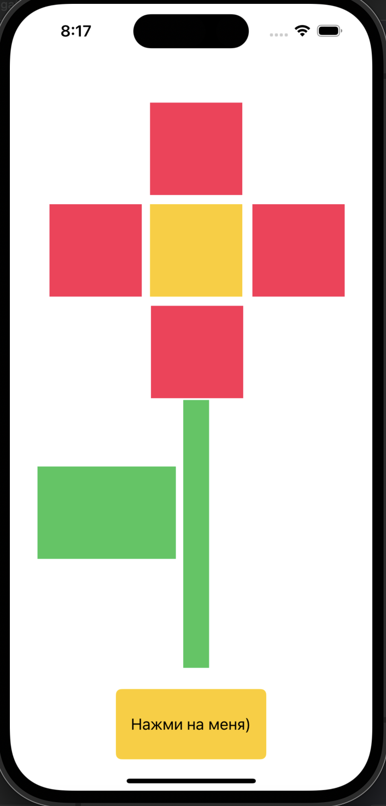
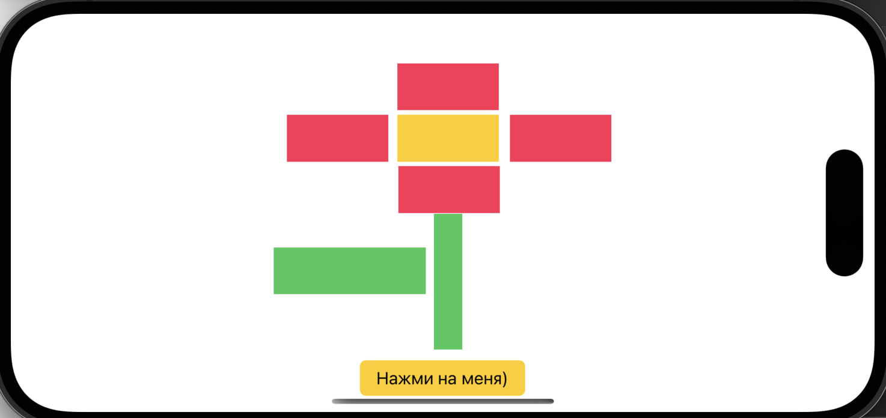

# Автор: Гудошникова Юлия Владимировна группа БПИ217

Работа выполнена с учетом всех критериев. 

Дополнительно стоит отметить, что у меня генерируются рандомные не повторяющиеся цвета для каждой группы(лепестки, сердцевина, листва). То есть внутри каждой из групп цвет будет одинаковый, но между группами цвета не повторяются. Я посчитала, что это не противоречит заданию и оно останется выполненным, однако так будет красивее.

Также были добавлены auto-resizing и auto-layout для корректного отображения в альбомном положении экрана

## Демонстрация

## Котик для хорошего настроения)
