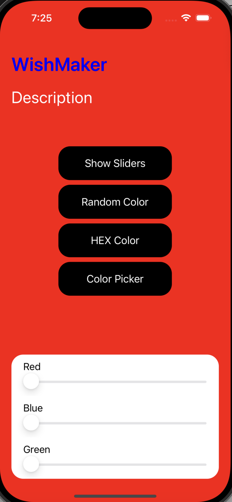
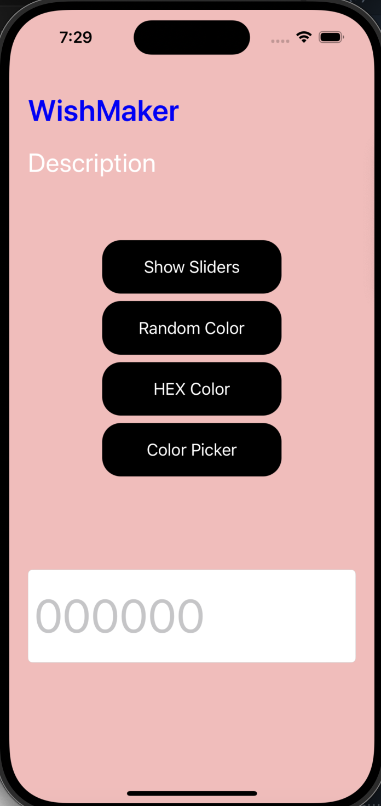
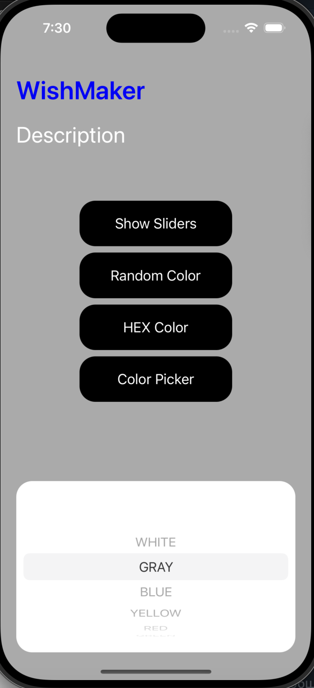

# Домашнее задание #2 по дисциплине «Основы iOS разработки»
## Тема: 
Использование UIKit и Auto-layout.
## Цель: 
Узнать, как никогда больше не использовать Storyboard. Получить опыт работы с
UIKit и auto-layout, в частности с констрейнтами.

# Вопросы, требующие ответа)
## Шаг 1
1) Какие проблемы мешают нам использовать storyboard в реальных проектах?
    Проблемы, выявленные при изучении различных статей:

        a) Множество контроллеров в одном месте приводит к тому, что storyboard становится слишком большим и тяжелым для работы с ним.

        б) При работе в команде возникают конфликты при слиянии изменений в storyboard, которые практически невозможно решить.

        в) Xcode тормозит при загрузке Storyboards!!!
    
        г) Усложняет поиск багов и их исправление.
## Шаг 3
2) Что делает код на строках 25 и 29?

        а) На строке 25 мы отключаем автоматически сгенерированные констрейнты, чтобы мы могли добавить свои и они работали.

        б) На строке 29 мы добавляем view на экран.
3) Что такое safe area layout guide?

    Safe area layout guide - это область, которая не перекрывается другими элементами интерфейса, такими как статус-бар, "челка" и т.д.
## Шаг 5
4) Что такое [weak self] на строке 23 и почему это важно?

    Weak self - это ссылка на объект, который не увеличивает счетчик ссылок на объект, на который она ссылается. Это важно, чтобы избежать утечек памяти.
5) Что означает clipsToBounds?

    ClipsToBounds - это свойство, которое определяет, будет ли содержимое внутри view обрезано по границам view.
6) Что такое тип valueChanged? Что такое Void и Double?

         var valueChanged: ((Double) -> Void)?

        а) ValueChanged - это переменная замыкания, обозначающая функцию, которая будет вызываться при изменении значения UISlider через функцию sliderValueChanged().

        б) Void - это тип возвращаемого значения функции, который означает, что функция ничего не возвращает.

        в) Double - это тип принимаемого значения функции, который означает, что функция принимает значение типа Double.

# Выполнение критериев
1) У приложения нет Main storyboard-а и оно успешно собирается. +
2) При запуске приложения показывается WishMakerViewController.+
    В моем случае он изначально красного цвета
3) WishMakerViewController содержит приветственный заголовок и описание. +
    Заголовок сделан синим жирным шрифтом. Описание размещено под заголовком белым цветом
4) Создан кастомный слайдер.+
5) Кастомный слайдер изменяет цвет фона. + 
    Цвет фона меняется при передвижении ползунков слайдеров
6) Код не содержит магических чисел. +
    Все подобные числа выделены в enum
7) На все «Вопросы» есть ответы в README.md проекта.+
8) Слайдеры изменения цвета могут быть спрятаны или показаны снова по
нажатию кнопки. +
    Для этого реализован стек кнопок, в частности кнопка "Show Sliders" отвечает за скрытие и открытие стека со слайдерами
10) 3 или более способов изменения цвета фона: (HEX, color picker, рандом).+
    В рамках работы реализованы дополнительные возможности изменения цвета:

        а) Кнопка "Random Color" устанавливает рандомный цвет фона

        б) Кнопка "HEX Color" открывает поле для ввода, в которое нужно ввести HEX код цвета в формате (000000). Это указано в placeholder

        в) Кнопка "Color Picker" открывает для пользователя UIPickerView, с помощью которого можно выбрать цвет из предложенных

# Результат работы(на 1 часть домашки)
## Интерфейс при запуске

## Интерфейс при выборе задания цвета через HEX

## Интерфейс при выборе задания цвета через Color Picker

# Хорошего дня!)

